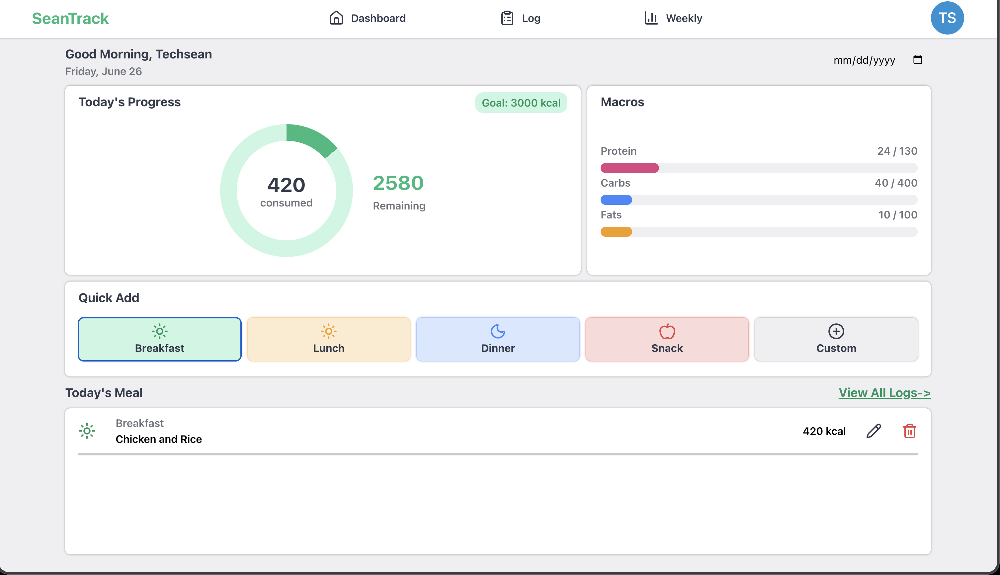
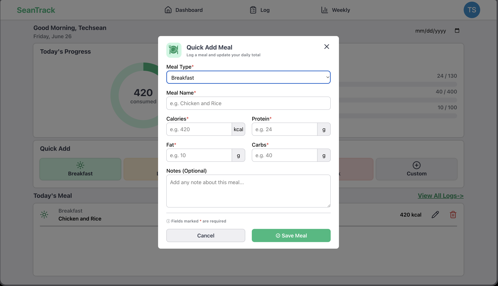

# SeanTrack

A web-based calorie tracking application built as the final project for [CS50](https://cs50.harvard.edu/). SeanTrack helps you log your daily meals and monitor your calorie intake with a clean, intuitive interface.





## Table of Contents
* [Features](#features)
* [Installation](#installation)
* [Usage](#usage)
* [To-Do](#to-do)
* [Preview](#preview)
* [Acknowledgments](#acknowledgments)
* [Credits](#credits)
* [License](#license)

## Features
* **Add Meal Entries**: Log meals with name, calorie count, and date.
* **Edit Entries**: Modify existing meal logs with ease.
* **Delete Entries**: Remove meals from your log when needed.
* **Date Picker**: Select specific dates to view or log meals for that day.
* **Calorie Summary**: Automatically tracks your total daily calorie intake.
* **Data Persistence**: Entries are stored in memory with unique IDs.
* **Clean UI**: Minimalist design focused on usability and readability.
* **Responsive Layout**: Works seamlessly across desktop and mobile devices.

## Installation
1. Clone the repository:
   ```bash
   git clone https://github.com/SrunTechsean/SeanTrack.git
   ```
2. Open `index.html` in any modern web browser.


## Usage
1. Open `index.html` in any modern web browser.
2. Click **"Add Meal"** to open the entry form.
3. Fill in the meal name, calorie count, and select a date.
4. Click **"Save"** — your meal will appear in the log.
5. To edit a meal, click the **edit icon** on its entry.
6. To delete a meal, click the **trash icon**.
7. Use the **date picker** to view logs for a specific day.

## To-Do
* **Backend Integration**: Build a full backend with a database to persist meal entries across sessions and devices.
* **User Authentication**: Add sign-up/login functionality for personalized tracking.
* **Data Visualization**: Include interactive charts and graphs to visualize calorie trends, weekly summaries, and nutritional insights.

## Preview
[Live Demo](https://sruntechsean.github.io/SeanTrack/)

## Acknowledgments
* This project was completed as the final project for [Harvard's CS50](https://cs50.harvard.edu/) course.
* Built as a practical application of full-stack web development concepts learned throughout the course.

## Credits
* **Icons**: [Lucide](https://lucide.dev/) for clean, open-source SVG icons.

## License
[MIT](https://github.com/SrunTechsean/SeanTrack/blob/main/LICENSE) © SrunTechsean
